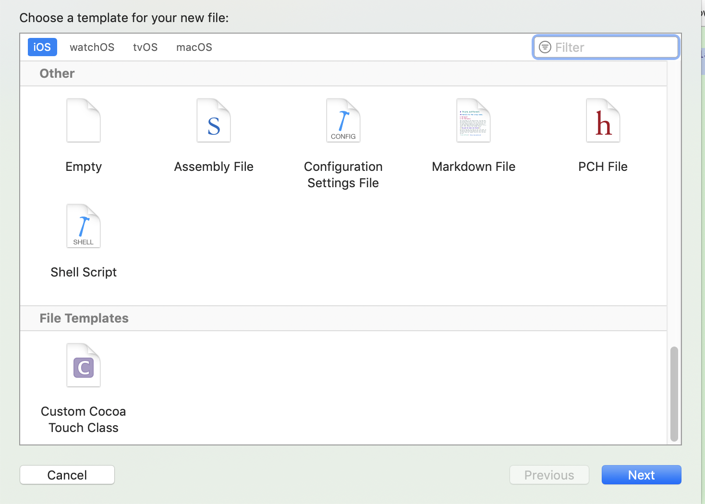
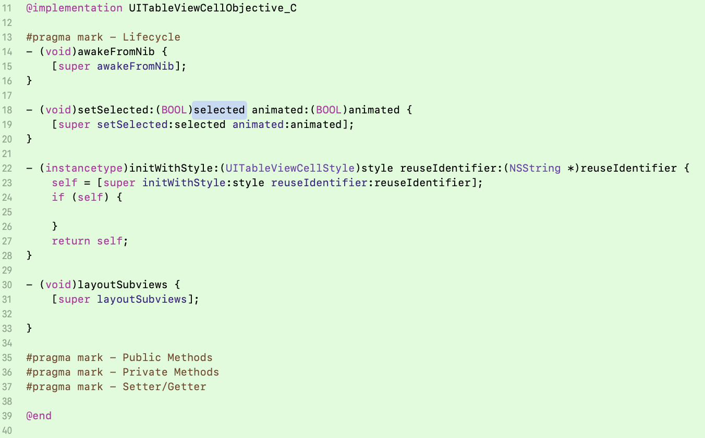
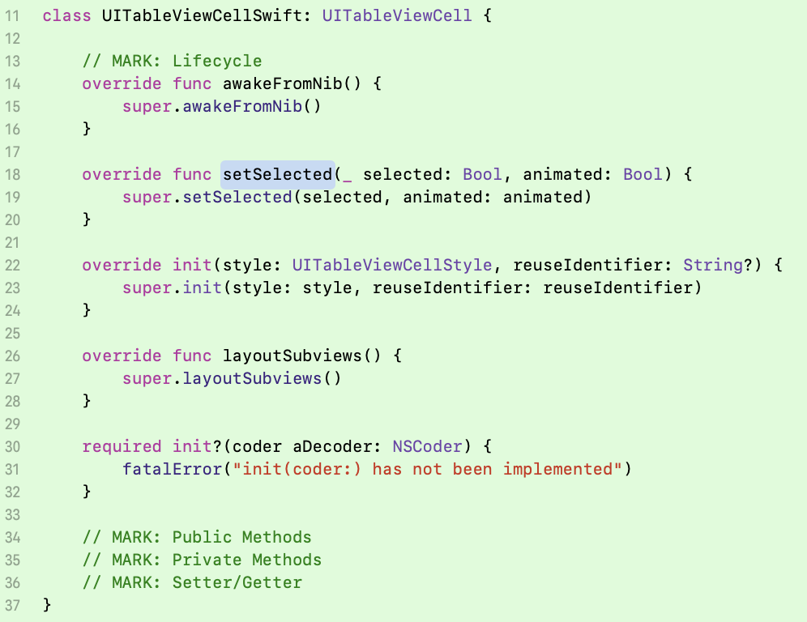

## Xcode-Project-Templates
	代码规范及工程模板(Objective-C、Swift)
	
### 代码规范
- [Objective-C][1]
- [Swift][2]

### 工程模板
- NSObjectObjective-C
- NSObjectSwift
- UICollectionReusableViewObjective-C
- UICollectionReusableViewSwift
- UICollectionReusableViewXIBObjective-C
- UICollectionReusableViewXIBSwift
- UICollectionViewCellObjective-C
- UICollectionViewCellSwift
- UICollectionViewCellXIBObjective-C
- UICollectionViewCellXIBSwift
- UICollectionViewControllerObjective-C
- UICollectionViewControllerSwift
- UICollectionViewControllerXIBObjective-C
- UICollectionViewControllerXIBSwift
- UITableViewCellObjective-C
- UITableViewCellSwift
- UITableViewCellXIBObjective-C
- UITableViewCellXIBSwift
- UITableViewControllerObjective-C
- UITableViewControllerSwift
- UITableViewControllerXIBObjective-C
- UITableViewControllerXIBSwift
- UIViewControllerObjective-C
- UIViewControllerSwift
- UIViewControllerXIBObjective-C 
- UIViewControllerXIBSwift
- UIViewObjective-C
- UIViewSwift

### 模板预览

 setup | UITableViewCellObjective-C | UITableViewCellSwift |
----|----|----|
||

#### 模板使用

下载并拷贝`Custom Cocoa Touch Class.xctemplate`文件夹至路径`Xcode.app/Contents/Developer/Platforms/iPhoneOS.platform/Developer/Library/Xcode/Templates/File Templates/Source`下

[1]: https://github.com/NYTimes/objective-c-style-guide "objective-c-style-guide"
[2]: https://github.com/raywenderlich/swift-style-guide "swift-style-guide"
